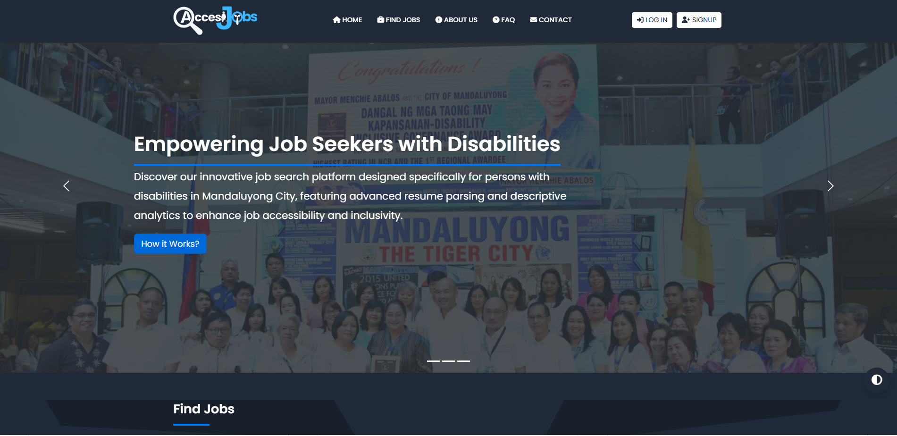
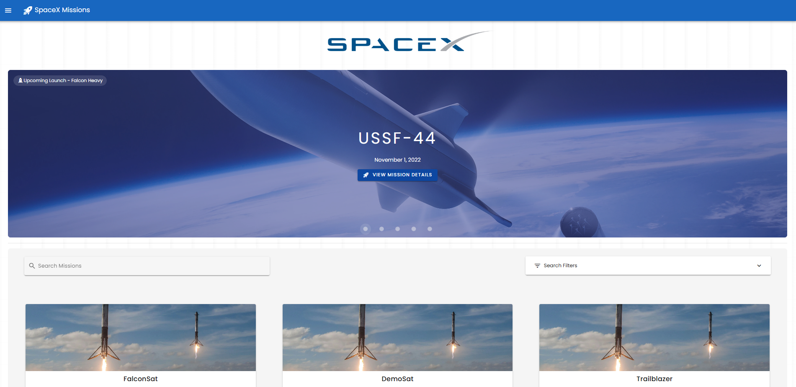
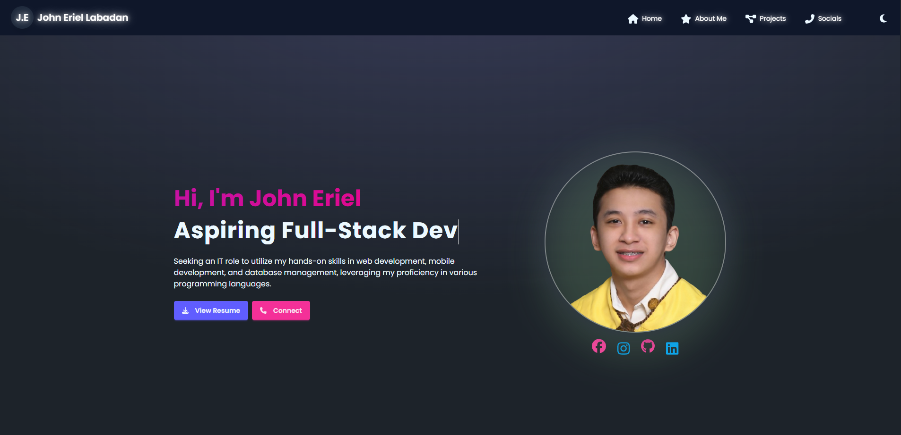
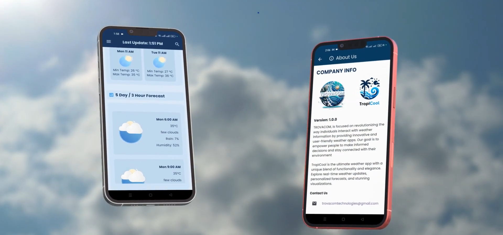

###

###

 
 
 
I’m currently learning Vue.js and Laravel Livewire 👨‍💻 
 
Learning everything about Frontend and Backend technologies 📚  
 
Future Goals: Learn more technologies - Never stop creating new ideas 💪🏼

###

<!-- Featured Projects Section -->
<table>
  <tr>
    <td width="50%">
      <h4 align="center">🧩 <u>AccesiJobs</u>: PWD Job Platform</h4>
      
  
        
          
        
        
      

      

        • ♿️ Accessibility Features (WCAG 2.1) 
        • 🧠 Resume Parsing via SpaCy NLP 
        • 📊 Analytics Dashboard
      

    </td>
    <td width="50%">
      <h4 align="center">🚀 SpaceX Missions (Nuxt + GraphQL)</h4>
      
  
        
          
        
        
      

      

        • 📅 Mission Timeline Display 
        • 🔍 SpaceX GraphQL Integration 
        • ⭐ Favorite Feature via LocalForage
      

    </td>
  </tr>
  <tr>
    <td width="50%">
      <h4 align="center">🌐 React.js E-Portfolio</h4>
      
  
        
          
        
        
      

      

        • 🎨 Daisy UI + Responsive Design 
        • 📱 Mobile-Ready Layout 
        • 📁 Simple Project Showcase
      

    </td>
    <td width="50%">
      <h4 align="center">🌦️ TropiCool: Weather + Social App</h4>
      
  
        
          
        
        
      

      

        • 📍 Real-Time Location Forecast 
        • 💬 Post & Report Weather Updates 
        • 📰 News, Alerts, Guides & More
      

    </td>
  </tr>
</table>

<table width="100%">
  <tr valign="top">
    <!-- Frontend -->
    <td width="33%">
      <h4 align="center">Frontend</h4>
      <table width="100%">
        <tr>
          <td></td>
          <td></td>
          <td></td>
        </tr>
        <tr>
          <td></td>
          <td></td>
          <td></td>
        </tr>
        <tr>
          <td></td>
          <td></td>
          <td></td>
        </tr>
      </table>
    </td>
    <!-- Backend -->
    <td width="33%">
      <h4 align="center">Backend</h4>
      <table width="100%">
        <tr>
          <td></td>
          <td></td>
          <td></td>
        </tr>
        <tr>
          <td></td>
          <td></td>
          <td></td>
        </tr>
        <tr>
          <td></td>
          <td></td>
          <td></td>
        </tr>
      </table>
    </td>
    <!-- Tools -->
    <td width="33%">
      <h4 align="center">Tools Used</h4>
      <table width="100%">
        <tr>
          <td></td>
          <td></td>
          <td></td>
        </tr>
        <tr>
          <td></td>
          <td></td>
          <td></td>
        </tr>
        <tr>
          <td></td>
          <td></td>
          <td></td>
        </tr>
      </table>
    </td>
  </tr>
</table>

    
  

  

   
   

